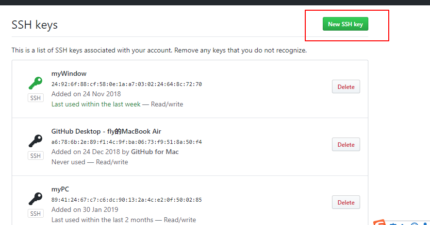

## git
+ 初始化git仓库 git init
+ 查看仓库状态 git status
+ 克隆仓库 git clone "url"
### 关联现有本地仓库
1. git remote add origin git@github.com:Freud233/web34.git
2. git push -u origin master

### 生成密钥
+ ssh-keygen -t rsa -C "humingx@yeah.net"
+ 找到密钥 cat ~/.ssh/id_rsa.pub
### 配对密钥
1. 
2. 
3. 
4. 
### 提交代码
1. git add . // 添加文件
2. git commit -m '内容' // 更新说明
3. git push // 推送